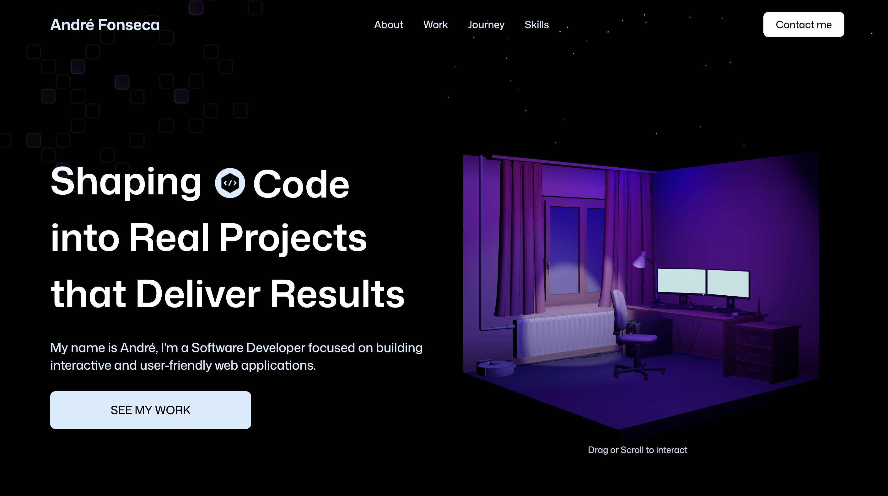

# 3D Portfolio - My Interactive Portfolio

This project is a **modern portfolio** built with **React JS**, showcasing my work with **interactive 3D elements** integrated into the UI.  
It combines **traditional web navigation** with **3D models and animations** to make the portfolio visually engaging.

## 🌐 Live Demo

Check out my live portfolio:  
[](https://andref218.github.io/3d_portfolio/)

[](https://andref218.github.io/3d_portfolio/)

---

## 🎯 Project Objectives

The main goals of this project are to:

- Showcase my work in a **clean and modern portfolio**
- Integrate **3D models and animations**
- Build a **responsive and interactive UI** with Tailwind CSS
- Use **React Three Fiber and Drei** for 3D model integration
- Implement **contact form functionality** using EmailJS

---

## 🛠️ Technologies & Libraries Used

- **React 19** – Main frontend framework
- **Vite** – Fast and modern build tool
- **Three.js** – 3D graphics library
- **React Three Fiber** – React renderer for Three.js
- **Drei** – Helpers for 3D models and scenes
- **GSAP** – Smooth animations and interactions
- **Tailwind CSS** – Modern responsive styling
- **EmailJS** – Contact form email sending

---

## 💡 Features

- Interactive **3D models** embedded in the website
- Smooth **animations with GSAP**
- Clean, responsive layout for desktop and mobile
- Reusable components for scalability
- Lightweight and fast, with modern frontend stack

---

## 🚀 Getting Started

Follow these steps to run the project locally:

### Installation

1. Clone the repository:

```bash
git clone https://github.com/andref218/3d_portfolio
cd 3d_portfolio
```

2. Install dependencies:

```bash
npm install
```

## 🔑 EmailJS Setup

To use the contact form, you need to set up your own EmailJS credentials and environment variables:

- Sign up or log in at [EmailJS](https://www.emailjs.com/).
- Create a **Service** and a **Template**.
- Obtain your **Public API Key**.

3. Setup environment variables:
   Create a `.env` file at the project root:

```env
VITE_APP_EMAILJS_SERVICE_ID=your_service_id_here
VITE_APP_EMAILJS_TEMPLATE_ID=your_template_id_here
VITE_APP_EMAILJS_PUBLIC_API_KEY=your_public_api_key_here
```

4. Run the development server:

```bash
npm run dev
```
