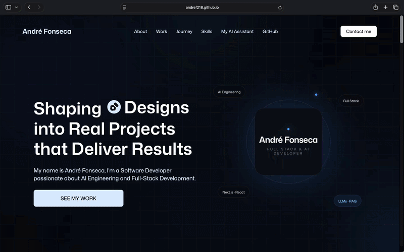

# 3D Portfolio - Interactive Portfolio & AI Assistant

This project is my personal **interactive portfolio**, built with **React, Vite, Tailwind CSS, Three.js, and React Three Fiber**.

It combines a modern responsive interface with interactive 3D elements, animations, and a **RAG-powered AI assistant** that allows visitors to ask questions about my background, education, experience, skills, projects, and AI journey.

## Live Portfolio 🌐

<p align="center">
  <a href="https://andref218.github.io/3d_portfolio/">
    
  </a>
</p>

<p align="center">
  <a href="https://andref218.github.io/3d_portfolio/">
    
  </a>
</p>

## AI Portfolio Assistant 🤖

One of the main features of this portfolio is a **Retrieval-Augmented Generation (RAG) AI assistant**.

The assistant allows visitors to ask questions about my background, education, professional experience, projects, skills, certifications, and AI journey.

Instead of relying solely on the language model's internal knowledge, the system retrieves relevant information from a curated portfolio knowledge base and provides it as context to the LLM before generating the final response.

### RAG Pipeline

```text
Portfolio Knowledge Base
          │
          ▼
   Document Processing
          │
          ▼
       Chunking
          │
          ▼
      Embeddings
          │
          ▼
   Chroma Vector Database
          │
          │
          │ User Question
          ▼
   Semantic Retrieval
          │
          ▼
    Top 4 Relevant Chunks
          │
          ▼
     Prompt Builder
          │
          ▼
       OpenRouter
          │
          ▼
         LLM
          │
          ▼
    Generated Answer
          │
          ▼
     React Frontend
```

### RAG Architecture

The complete RAG pipeline follows these steps:

1. **Knowledge Base**

   Portfolio information is organized into structured Markdown documents covering areas such as education, experience, projects, skills, and certifications.

2. **Document Processing**

   The knowledge documents are loaded, processed, and split into smaller chunks to make them suitable for semantic retrieval.

3. **Embeddings**

   Each document chunk is converted into a vector representation using the `text-embedding-3-small` embedding model through OpenRouter.

4. **Vector Database**

   The generated embeddings are stored in a **Chroma vector database**, allowing the system to efficiently search for semantically relevant information.

5. **Semantic Retrieval**

   When a user submits a question, the question is converted into an embedding and compared against the vectors stored in Chroma.

   The system retrieves the **top 4 most relevant document chunks** based on semantic similarity.

6. **Prompt Construction**

   The retrieved documents are passed to a prompt builder together with the original user question.

   This provides the language model with relevant, grounded context about my portfolio.

7. **LLM Generation**

   The resulting prompt is sent to the language model through **OpenRouter**, which generates the final response using the retrieved portfolio context.

8. **Response**

   The generated answer is returned by the FastAPI backend to the React frontend and displayed in the AI Assistant chat.

### Why RAG?

The main purpose of using RAG in this project is to make the AI assistant **ground its answers in information about my actual portfolio**.

This approach allows the assistant to retrieve the most relevant information from the knowledge base for each question instead of relying exclusively on the model's general knowledge.

It also makes the knowledge base easier to maintain: portfolio information can be updated in the Markdown source files and the vector database can then be regenerated with the updated content.

---

## Project Objectives

The main goals of this project are to:

- Showcase my work in a **clean and modern portfolio**
- Integrate **3D models and animations**
- Build a **responsive and interactive UI** with Tailwind CSS
- Use **React Three Fiber and Drei** for 3D model integration
- Build and deploy a **production RAG application**
- Apply **semantic retrieval** to real portfolio data
- Integrate **LLMs and embedding models through APIs**
- Implement API protection through **rate limiting**
- Explore practical **AI Engineering** concepts in a real-world project
- Implement contact form functionality using **EmailJS**

---

## Technologies & Libraries Used

### Frontend

- **React** – Main frontend framework
- **Vite** – Fast and modern build tool
- **Three.js** – 3D graphics library
- **React Three Fiber** – React renderer for Three.js
- **GSAP** – Smooth animations and interactions
- **Tailwind CSS** – Responsive styling
- **Lucide React** – UI icons
- **EmailJS** – Contact form email sending

### AI & Backend

- **Python** – Backend and RAG implementation
- **FastAPI** – REST API framework
- **LangChain** – RAG orchestration and integrations
- **Chroma** – Vector database
- **OpenRouter** – LLM and embedding API provider
- **OpenAI `text-embedding-3-small`** – Embedding model
- **SlowAPI** – API rate limiting
- **Uvicorn** – ASGI server
- **uv** – Python package and environment management

---

## Features

### Portfolio

- Interactive **3D models** embedded in the website
- Smooth **animations with GSAP**
- Responsive layout for desktop and mobile
- Reusable React components
- Modern UI built with Tailwind CSS
- Contact form using EmailJS

### AI Assistant

- **RAG-powered AI assistant**
- Semantic search over portfolio information
- Curated Markdown knowledge base
- Chroma vector database
- LLM-powered answer generation
- Top-K document retrieval
- FastAPI backend
- API rate limiting
- Frontend error handling
- Automatic backend wake-up for Render cold starts

---

## AI Backend Architecture

The AI assistant runs through a dedicated **FastAPI backend**, separated from the React frontend.

```text
React Portfolio
      │
      │ POST /chat
      ▼
    FastAPI
      │
      ▼
  RAG Pipeline
      │
      ├── Retriever
      │      │
      │      ▼
      │  Chroma Vector DB
      │      │
      │      ▼
      │ Relevant Documents
      │
      ▼
 Prompt Builder
      │
      ▼
 OpenRouter
      │
      ▼
     LLM
      │
      ▼
 AI Response
      │
      ▼
 React Chat
```

### API Endpoints

#### `GET /health`

Health check endpoint used by the frontend to wake up the backend when the Render instance is sleeping.

```json
{
  "status": "ok"
}
```

#### `POST /chat`

Receives a user question and returns a RAG-generated answer.

Example request:

```json
{
  "question": "What technologies did André use in Vynilz?"
}
```

Example response:

```json
{
  "answer": "..."
}
```

---

## API Protection

The `/chat` endpoint is protected using **SlowAPI rate limiting**.

The current limit is:

```text
20 requests per hour per IP address
```

This helps prevent excessive API usage and protects the underlying LLM and embedding services from automated abuse.

The frontend also handles HTTP `429` responses and displays a user-friendly message when the rate limit is reached.

---

## Deployment

The project uses a separate frontend and backend deployment architecture.

### Frontend

The React/Vite portfolio is deployed using **GitHub Pages**.

### Backend

The FastAPI RAG backend is deployed using **Render**.

Because the backend runs on a free Render instance, it can enter a sleep state after periods of inactivity.

To improve the first-request experience, the frontend automatically calls:

```text
GET /health
```

when the application starts.

This allows the backend to begin waking up while the visitor is browsing the portfolio.

While the backend is starting, the AI Assistant displays a small status message informing the user that the first response may take longer.

---

## Getting Started 🚀

Follow these steps to run the project locally.

### Frontend

#### Installation

1. Clone the repository:

```bash
git clone https://github.com/andref218/3d_portfolio
cd 3d_portfolio
```

2. Install dependencies:

```bash
npm install
```

3. Start the development server:

```bash
npm run dev
```

---

### Frontend Environment Variables 🔑

The frontend uses separate environment files for shared credentials and environment-specific configuration.

#### Shared Environment Variables

Create a `.env` file at the project root:

```env
VITE_APP_EMAILJS_SERVICE_ID=your_service_id_here
VITE_APP_EMAILJS_TEMPLATE_ID=your_template_id_here
VITE_APP_EMAILJS_PUBLIC_API_KEY=your_public_api_key_here
```

These variables are used by the EmailJS contact form in both development and production.

#### Development

Create a `.env.development` file at the project root:

```env
VITE_API_URL=http://localhost:8000
```

This points the frontend to the local FastAPI backend during development.

#### Production

Create a `.env.production` file at the project root:

```env
VITE_API_URL=https://portfolio-ai-api-ypy5.onrender.com
```

This points the production frontend to the deployed FastAPI backend on Render.

Vite automatically loads the appropriate environment file depending on the current mode.

### EmailJS Setup

To use the contact form:

1. Sign up or log in to EmailJS.
2. Create a Service.
3. Create a Template.
4. Obtain your Public API Key.
5. Add the EmailJS credentials to the `.env` file.

---

## AI Backend Setup 🤖

The RAG backend is located in:

```text
portfolio-ai-api/
```

### Requirements

- Python 3.12+
- uv
- OpenRouter API key

### Installation

```bash
cd portfolio-ai-api
uv sync
```

### Environment Variables

Create a `.env` file inside `portfolio-ai-api/`:

```env
OPENROUTER_API_KEY=your_openrouter_api_key
```

### Run the Backend

```bash
uv run uvicorn main:app --reload
```

The API will be available at:

```text
http://localhost:8000
```

Swagger documentation:

```text
http://localhost:8000/docs
```

---

## Testing the RAG Pipeline 🧪

The individual RAG components can be tested independently.

### Test Semantic Retrieval

```bash
uv run -m src.rag.retriever
```

This allows you to enter a question and inspect the retrieved document chunks, including their metadata and content.

### Test Answer Generation

```bash
uv run -m src.rag.answer
```

This runs the complete pipeline:

```text
Question
   ↓
Retrieval
   ↓
Context
   ↓
Prompt
   ↓
LLM
   ↓
Answer
```

---

## Project Structure 📁

```text
3d_portfolio/
│
├── src/
│   ├── components/
│   │   └── Chat/
│   ├── sections/
│   ├── lib/
│   │   └── api.ts
│   └── ...
│
├── portfolio-ai-api/
│   ├── data/
│   │   ├── knowledge/
│   │   └── vector_db/
│   │
│   ├── src/
│   │   ├── api/
│   │   ├── llm/
│   │   ├── rag/
│   │   └── security/
│   │
│   ├── main.py
│   ├── pyproject.toml
│   └── uv.lock
│
├── public/
├── package.json
└── README.md
```

---

## Knowledge Base 📚

The AI assistant uses a curated collection of Markdown files as its source of knowledge.

Examples include:

- `education.md`
- `experience.md`
- Project information
- Skills
- Certifications
- AI Engineering experience

The knowledge base is intentionally maintained separately from the application logic.

When information changes, the Markdown files can be updated and the vector database regenerated so that the assistant can retrieve the new information.

---

## Key AI Engineering Concepts

This project allowed me to apply several practical AI Engineering concepts:

- **Retrieval-Augmented Generation (RAG)**
- **Embeddings**
- **Vector databases**
- **Semantic search**
- **Document chunking**
- **Top-K retrieval**
- **Prompt construction**
- **LLM integration**
- **REST API development**
- **Rate limiting**
- **Cloud deployment**
- **Cold-start handling**
- **Frontend/backend integration**

---

## Author 👨‍💻

**André Fonseca**

Computer Science graduate focused on **Full-Stack Development and AI Engineering**.

**Portfolio:**  
https://andref218.github.io/3d_portfolio/
